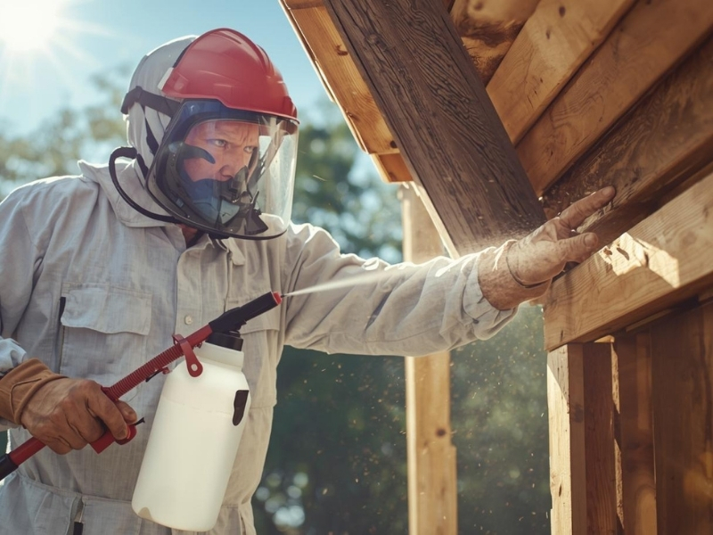

## O Que Faz uma Dedetizadora de Cupins e Como É o Dia a Dia desse Serviço

Você já se deparou com um montinho de pó de madeira no chão, pequenos túneis nas paredes ou, pior, viu seus móveis sendo devorados sem piedade? Se sim, provavelmente está lidando com cupins, pragas que podem causar estragos incalculáveis em sua propriedade. É nesse cenário que entra em ação a **dedetizadora de cupins**, uma empresa especializada em identificar, controlar e eliminar infestações desses insetos.

O dia a dia de uma dedetizadora de cupins é dinâmico e exige conhecimento técnico, agilidade e atenção aos detalhes. Não se trata apenas de aplicar veneno aleatoriamente. O trabalho começa com uma **vistoria detalhada** no local infestado. Profissionais treinados buscam sinais da presença de cupins, como túneis de terra, asas descartadas, sons ocos na madeira e até mesmo a visualização dos próprios insetos. Essa etapa é crucial para determinar a espécie do cupim (subterrâneos, de madeira seca ou arbóreos) e a extensão da infestação.

Com base na vistoria, a equipe elabora um **plano de ação personalizado**, que pode envolver diferentes métodos de controle. A execução do serviço requer o uso de equipamentos de proteção individual (EPIs), manuseio seguro de produtos químicos e, muitas vezes, a necessidade de perfurar estruturas para acesso aos ninhos. A dedetização não termina com a aplicação inicial; muitas empresas oferecem **monitoramento pós-tratamento** e orientações para prevenção de novas infestações.

Em resumo, o trabalho de uma [dedetizadora de cupins](https://desentupidoraemsorocaba.eco.br/) é uma combinação de investigação, estratégia e execução precisa para proteger o patrimônio e a tranquilidade de seus clientes.

**Leia também:** [Limpa Fossa: Tudo Sobre o Serviço Essencial e Profissional](/blog/limpa-fossa-guia-completo)

## Formação Necessária e Onde Estudar para Atuar em uma Dedetizadora

Para atuar como técnico em uma **dedetizadora de cupins**, não existe um curso universitário específico, mas sim uma combinação de formação técnica e treinamentos práticos. Profissionais da área geralmente possuem:

-   **Ensino Médio Completo:** Base para qualquer formação técnica.
    
-   **Cursos Técnicos em Controle de Pragas:** Existem cursos profissionalizantes voltados especificamente para o controle de pragas urbanas, que abordam temas como biologia dos insetos, métodos de controle, segurança no manuseio de produtos químicos, legislação e ética profissional. Esses cursos são oferecidos por instituições de ensino técnico e centros de treinamento especializados.
    
-   **Treinamentos e Certificações:** Muitas empresas do setor oferecem treinamentos internos ou exigem certificações específicas para o manuseio de determinados produtos e equipamentos. A participação em workshops e seminários sobre novas técnicas e produtos é fundamental para a atualização profissional.
    
-   **Licenças e Autorizações:** Dependendo da legislação local e do tipo de serviço, pode ser necessário que a empresa e seus técnicos possuam licenças específicas emitidas por órgãos de saúde e meio ambiente.
    

**Onde encontrar esses cursos:**

-   **SENAI e outras escolas técnicas:** Busque por cursos de controle de pragas ou áreas correlatas.
    
-   **Associações de Controle de Pragas:** Muitas associações oferecem cursos e treinamentos ou podem indicar instituições de ensino relevantes.
    
-   **Empresas especializadas:** Algumas dedetizadoras maiores possuem seus próprios programas de treinamento e capacitação.
    

A experiência prática e o aprendizado contínuo são tão importantes quanto a formação formal para se tornar um especialista em controle de cupins.

## Habilidades e Competências Essenciais Desse Profissional

Para ser um profissional de destaque em uma **dedetizadora de cupins**, é preciso ir além do conhecimento técnico. Algumas habilidades e competências são cruciais para o sucesso na área:

-   **Conhecimento de Biologia dos Cupins:** Compreender o ciclo de vida, hábitos alimentares, reprodução e comportamento social das diferentes espécies de cupins é fundamental para identificar o problema e aplicar o tratamento correto.
    
-   **Conhecimento de Produtos e Métodos:** Saber quais inseticidas usar para cada tipo de infestação, as dosagens corretas, os riscos envolvidos e os diferentes métodos de aplicação (barreira química, iscagem, tratamento de madeiras, etc.).
    
-   **Percepção e Observação:** Capacidade de identificar sinais sutis da presença de cupins que muitos não notariam, como pequenos orifícios, resíduos e mudanças na textura da madeira.
    
-   **Habilidades de Comunicação:** Explicar ao cliente o problema, o plano de tratamento, as medidas preventivas e responder a dúvidas de forma clara e profissional.
    
-   **Atenção à Segurança:** Essencial para manusear produtos químicos, utilizar equipamentos de proteção individual e garantir a segurança do cliente e do meio ambiente.
    
-   **Raciocínio Lógico e Resolução de Problemas:** Cada infestação é única e exige uma abordagem personalizada. O profissional precisa analisar a situação e desenvolver a melhor estratégia.
    
-   **Paciência e Persistência:** O controle de cupins pode ser um processo demorado e exigir múltiplas visitas, especialmente em infestações severas.
    
-   **Ética e Responsabilidade:** Trabalhar com produtos químicos e na casa das pessoas exige um alto padrão de ética, honestidade e responsabilidade.
    
-   **Disposição para Trabalho Físico:** O serviço muitas vezes envolve levantar móveis, perfurar paredes e trabalhar em diferentes ambientes e posições.
    

## Mercado de Trabalho e Áreas de Atuação para Dedetizadoras

O mercado para **dedetizadoras de cupins** é vasto e constante, impulsionado pela presença generalizada dessas pragas em diversas regiões. A atuação não se restringe apenas a residências, abrangendo uma ampla gama de clientes:

-   **Residências:** Casas, apartamentos, condomínios e moradias de todos os tipos são os clientes mais comuns, buscando proteger seus bens e estruturas.
    
-   **Comércio:** Lojas, escritórios, restaurantes, hotéis e outros estabelecimentos comerciais precisam manter suas instalações livres de cupins para preservar sua imagem, evitar danos estruturais e cumprir normas sanitárias.
    
-   **Indústrias:** Indústrias, especialmente aquelas que armazenam produtos orgânicos ou utilizam estruturas de madeira, são clientes importantes para controle de cupins.
    
-   **Instituições Públicas:** Escolas, hospitais, bibliotecas, museus e prédios governamentais frequentemente necessitam de serviços de controle de pragas, dado o grande fluxo de pessoas e a necessidade de preservar bens e documentos.
    
-   **Companhias de Construção e Imobiliárias:** Empresas do setor podem contratar dedetizadoras para tratamentos preventivos em novas construções ou para inspeções em imóveis à venda ou para alugar.
    
-   **Empresas de Logística e Armazenagem:** Locais que abrigam grandes estoques, muitas vezes em embalagens ou paletes de madeira, exigem controle rigoroso para evitar perdas e contaminações.
    
-   **Patrimônio Histórico:** Edificações antigas, muitas vezes construídas com muita madeira, são alvos constantes de cupins e exigem tratamentos especializados e cuidadosos.
    

A demanda por dedetizadoras de cupins é contínua, uma vez que a infestação por cupins é um problema recorrente e que pode aparecer a qualquer momento. A reputação da empresa, a qualidade do serviço e a eficácia dos tratamentos são fatores cruciais para o sucesso neste mercado.

## Salário Médio e Perspectivas de Crescimento na Área

O salário médio de um profissional que atua em uma **dedetizadora de cupins** pode variar significativamente dependendo de diversos fatores, como região do país, porte da empresa, nível de experiência do profissional e a complexidade dos serviços prestados.

**Em um espectro geral:**

-   **Técnicos Iniciantes:** Podem começar com um salário próximo ao piso da categoria ou salário mínimo, com bonificações por produtividade.
    
-   **Técnicos Experientes:** Com alguns anos de experiência e capacitações, o salário pode ser mais atrativo, principalmente se o profissional tiver especialização em técnicas avançadas de controle de cupins.
    
-   **Coordenadores e Supervisores:** Profissionais que assumem cargos de liderança, supervisionando equipes e planejando operações, têm salários mais elevados.
    
-   **Empreendedores:** Donos de dedetizadoras, com o tempo e um negócio bem estabelecido, podem ter rendimentos substancialmente maiores, dependendo do sucesso da empresa.
    

**Perspectivas de Crescimento:**

A área de controle de pragas, em especial a de cupins, apresenta boas perspectivas de crescimento e desenvolvimento de carreira:

-   **Especialização:** O profissional pode se especializar em diferentes tipos de pragas, tratamentos específicos para cupins (como métodos de iscagem avançados ou tratamento de madeiras), ou no atendimento a segmentos específicos (como bens tombados ou indústrias).
    
-   **Liderança:** Com experiência, é possível progredir para cargos de supervisão, coordenação de equipes e gerência de operações.
    
-   **Consultoria:** Profissionais experientes podem atuar como consultores, oferecendo seus conhecimentos para empresas ou indivíduos.
    
-   **Empreendedorismo:** Muitos técnicos acabam abrindo suas próprias dedetizadoras, tornando-se empresários e gerando seus próprios empregos e oportunidades.
    
-   **Treinamento:** Profissionais com amplo conhecimento e didática podem se tornar instrutores em cursos de controle de pragas.
    

O investimento em capacitação contínua e a busca por certificações são diferenciais importantes para quem busca ascendência profissional e melhores remunerações no setor.

## Como Escolher a Melhor Dedetizadora de Cupins (Passo a Passo e Dicas Práticas)

Escolher a **dedetizadora de cupins** certa é crucial para garantir um serviço eficaz e seguro. Um erro pode não só não resolver o problema, como também expor sua família e seu patrimônio a riscos. Siga este passo a passo para fazer a melhor escolha:

### 1\. Pesquise e Peça Recomendações

-   **Online:** Utilize motores de busca (Google, Bing) e plataformas de avaliação (Reclame Aqui, Google Meu Negócio, redes sociais) para encontrar empresas na sua região.
    
-   **Amigos e Familiares:** Pergunte a pessoas de confiança se já utilizaram alguma dedetizadora e qual foi a experiência delas.
    
-   **Portais Especializados:** Existem sites que listam e avaliam dedetizadoras.
    

### 2\. Verifique a Legalidade e a Reputação

-   **Licenças e Certificações:** A empresa deve possuir licenças válidas da Anvisa (Agência Nacional de Vigilância Sanitária) e outros órgãos ambientais ou de saúde locais. Não hesite em pedir os comprovantes.
    
-   **CNPJ:** Verifique a situação cadastral da empresa.
    
-   **Reputação Online:** Analise as avaliações e comentários de clientes em diversas plataformas. Empresas com muitas reclamações sem solução são um alerta.
    

### 3\. Solicite Orçamentos e Vistorias no Local

-   **Vistoria Gratuita:** Uma dedetizadora séria sempre oferecerá uma vistoria gratuita no local antes de emitir um orçamento. Desconfie de empresas que oferecem orçamentos por telefone sem avaliar a extensão do problema.
    
-   **Orçamento Detalhado:** O orçamento deve especificar: a espécie do cupim identificada, o método de tratamento proposto, os produtos a serem utilizados (com registro na Anvisa), a duração do serviço, a garantia e o valor total.
    
-   **Compare Orçamentos:** Não se atenha apenas ao preço. Compare o que cada empresa oferece em termos de serviço, produtos e garantia.
    

### 4\. Entenda o Método de Tratamento e os Produtos

-   **Explicação Clara:** O técnico deve explicar de forma didática qual será o método de controle (barreira química, iscagem, descupinização localizada, etc.) e o porquê da escolha.
    
-   **Registro na Anvisa:** Certifique-se de que os produtos químicos utilizados são registrados e aprovados pela Anvisa. Peça para ver os rótulos se tiver dúvidas.
    
-   **Segurança:** Pergunte sobre as precauções de segurança necessárias antes, durante e depois do serviço, principalmente se houver crianças, idosos ou animais de estimação na residência.
    

### 5\. Analise a Garantia e o Pós-Venda

-   **Período de Garantia:** Uma boa dedetizadora oferece um período de garantia para o serviço, que pode variar de 3 meses a 1 ano, dependendo da espécie do cupim e do tratamento.
    
-   **Suporte Pós-Serviço:** Verifique se a empresa oferece suporte caso os cupins retornem dentro do período de garantia.
    

### 6\. Contrato e Nota Fiscal

-   **Contrato:** Certifique-se de que todos os termos acordados (serviço, valor, garantia) estejam em um contrato claro.
    
-   **Nota Fiscal:** Exija nota fiscal do serviço. Ela é sua garantia legal em caso de problemas.
    

Ao seguir estas dicas, você aumenta significativamente as chances de contratar uma **dedetizadora de cupins** confiável e que realmente solucionará seu problema com essas pragas.

## Perguntas Frequentes Sobre Dedetizadora de Cupins

### O que é uma dedetizadora de cupins?

Uma **dedetizadora de cupins** é uma empresa especializada em controle de pragas que oferece serviços de inspeção, identificação, tratamento e monitoramento para eliminar infestações de cupins em diferentes tipos de imóveis.

### Quando devo chamar uma dedetizadora de cupins?

Você deve chamar uma dedetizadora de cupins assim que notar qualquer sinal da presença desses insetos, como pó de madeira (grânulos fecais) em móveis, túneis de terra em paredes ou vigas, asas descartadas, madeiras ocas ao toque ou a presença visual dos próprios cupins. Quanto antes for feito o tratamento, menores serão os danos.

### Qual a diferença entre cupim subterrâneo e cupim de madeira seca?

Os **cupins subterrâneos** vivem em colônias no solo e constroem galerias de terra para chegar à madeira. Já os **cupins de madeira seca** vivem e se alimentam dentro da própria madeira, sem contato com o solo, e produzem um pó granular característico como resíduo fecal.

### Quais são os métodos de tratamento utilizados por uma dedetizadora de cupins?

Os métodos mais comuns incluem: **barreira química** (injeção de inseticida no solo ao redor da estrutura), **tratamento de madeiras** (injeção ou pulverização de inseticidas diretamente na madeira infestada), **sistema de iscagem** (instalação de iscas com produtos que os cupins levam para a colônia) e **fumigação** (em casos específicos e mais severos, onde o local é isolado e exposto a um gás tóxico).

### Os produtos usados são seguros para crianças e animais de estimação?

A segurança dos produtos varia. Empresas sérias utilizam produtos registrados na Anvisa e informam sobre as precauções. É comum que seja necessário afastar crianças e animais do local durante e por um período após a aplicação. Sempre questione a **dedetizadora de cupins** sobre os produtos e as medidas de segurança.

### Quanto tempo dura o efeito da dedetização de cupins?

A duração da eficácia do tratamento varia conforme o método, os produtos utilizados e o nível da infestação. Geralmente, as dedetizadoras oferecem um período de garantia, que pode ir de 3 meses a 1 ano. A execução de medidas preventivas é fundamental para prolongar os resultados.

### Posso dedetizar cupins por conta própria?

Não é recomendado tentar dedetizar cupins por conta própria. Os produtos de venda livre geralmente não são eficazes para eliminar a colônia inteira e o manuseio incorreto de inseticidas pode ser perigoso para a saúde e o meio ambiente. A identificação correta da espécie e a aplicação do método adequado exigem conhecimento técnico.

### Qual o preço médio de uma dedetização de cupins?

O preço de uma dedetização de cupins pode variar muito. Fatores como o tamanho da área a ser tratada, a espécie do cupim, o grau de infestação e o método escolhido influenciam diretamente no valor. É essencial solicitar uma vistoria e um orçamento detalhado para ter um valor preciso.

### Como prevenir futuras infestações de cupins?

Algumas medidas preventivas incluem: eliminar acúmulo de madeira em contato com o solo, vedar rachaduras e frestas, evitar umidade excessiva, realizar inspeções periódicas, aplicar vernizes e tintas com cupinicida em madeiras e instalar telas anti-insetos em janelas e portas.

### A dedetizadora oferece garantia no serviço?

Sim, a maioria das **dedetizadoras de cupins** profissionais oferece garantia para seus serviços. É importante verificar o período de garantia e quais são as condições de acionamento em caso de reinfestação.
