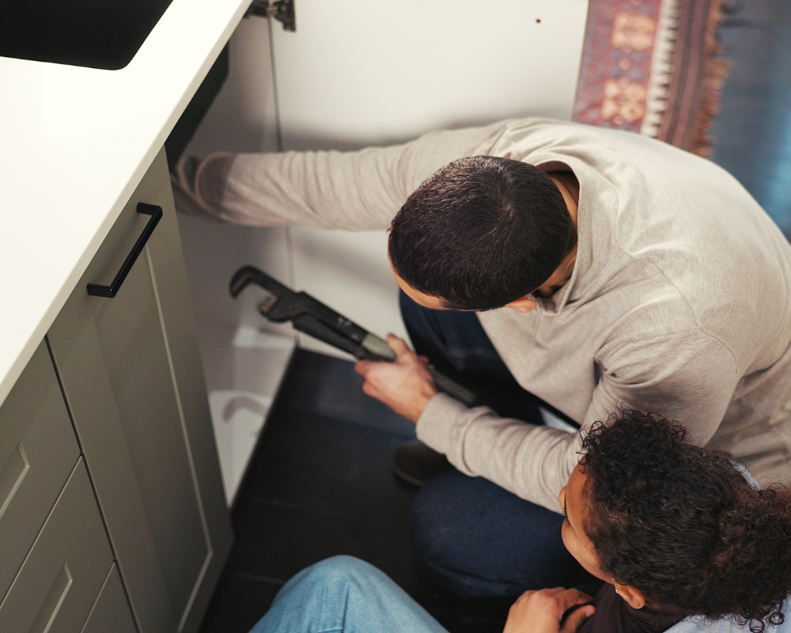

## O Que Faz o Desentupimento de Caixa de Gordura?

Você com certeza já deve ter ouvido falar na **caixa de gordura**, mas talvez não saiba exatamente o **desentupimento de caixa de gordura**. Esse serviço, essencial para a saúde da sua tubulação e do meio ambiente, consiste na remoção de acúmulos de gordura, óleo e outros resíduos que se solidificam dentro da caixa, impedindo o fluxo normal da água.

A [caixa de gordura](https://desentupidoraemcampinas.eco.br/desentupidora-em-campinas/) funciona como um filtro, retendo os dejetos gordurosos da pia da cozinha antes que eles cheguem à rede de esgoto. Quando essa caixa não é limpa regularmente, a gordura se acumula, endurece e acaba entupindo a passagem da água, causando mau cheiro, refluxo de esgoto e até mesmo a contaminação do solo e da água.

### Como é o Dia a Dia de uma Caixa de Gordura Entupida?

O dia a dia com uma caixa de gordura entupida é, no mínimo, desagradável. Você notará:

-   **Lentidão no escoamento da água da pia da cozinha:** A água desce devagar, formando poças.
    
-   **Mau cheiro:** Um odor forte e desagradável vindo dos ralos e da própria caixa.
    
-   **Refluxo de esgoto:** A água suja pode voltar pelos ralos da cozinha ou até mesmo do banheiro.
    
-   **Transbordamento da caixa de gordura:** Em casos mais graves, a caixa pode transbordar, espalhando dejetos pelo quintal.
    
-   **Aumento da proliferação de pragas:** Baratas e ratos são atraídos pelo acúmulo de matéria orgânica.
    

Ignorar esses sinais não é uma opção, pois os problemas só tendem a piorar, culminando em transtornos e custos mais elevados para a resolução.

## Formação Necessária e Onde Estudar para Profissionais de Desentupimento

Embora não exista uma "faculdade de desentupimento", os profissionais que atuam com **desentupimento de caixa de gordura** e outros serviços de limpeza e manutenção de sistemas de esgoto geralmente possuem formação técnica em áreas como hidráulica, saneamento ou ambiental. Muitos aprendem na prática, como auxiliares de desentupidoras ou por meio de cursos profissionalizantes específicos.

Existem diversos cursos técnicos e livres que abordam o funcionamento de redes hidráulicas, sistemas de esgoto e tecnologias de desentupimento. Além disso, as empresas especializadas frequentemente oferecem treinamentos internos para capacitar suas equipes nas melhores práticas e no uso de equipamentos de ponta.

### Onde Estudar e Se Capacitar:

-   **Cursos Técnicos em Hidráulica ou Saneamento:** Oferecidos por escolas técnicas como o Senai e outras instituições de ensino profissionalizante.
    
-   **Cursos Livres e Profissionalizantes:** Diversas empresas e centros de treinamento oferecem cursos específicos em técnicas de desentupimento, uso de equipamentos como hidrojateamento e manejo de resíduos.
    
-   **Treinamento 'On-the-Job':** Muitos profissionais adquirem experiência trabalhando como ajudantes em desentupidoras experientes.
    

## Habilidades e Competências Essenciais de um Bom Desentupimento

Um bom profissional ou mesmo um proprietário que busca realizar o **desentupimento de caixa de gordura** de forma eficaz, precisa de algumas habilidades e competências:

-   **Conhecimento Técnico:** Entender o funcionamento da rede hidráulica e da caixa de gordura.
    
-   **Higiene e Segurança:** Utilizar Equipamentos de Proteção Individual (EPIs), como luvas e máscaras, e seguir normas de segurança.
    
-   **Destreza Manual:** Habilidade para manusear ferramentas e equipamentos de desentupimento.
    
-   **Resolução de Problemas:** Capacidade de identificar a causa do entupimento e aplicar a melhor solução.
    
-   **Manutenção Preventiva:** Saber orientar sobre a limpeza regular e boas práticas para evitar futuros entupimentos.
    
-   **Disposição para o Trabalho Braçal:** O serviço muitas vezes exige esforço físico.
    

## Mercado de Trabalho e Áreas de Atuação para Serviços de Desentupimento

O mercado de trabalho para serviços de **desentupimento de caixa de gordura** é constante e necessário. Afinal, onde há cozinhas, há caixas de gordura e, consequentemente, a necessidade de sua limpeza e desobstrução.

As principais áreas de atuação são:

-   **Residências:** Condomínios e casas particulares são clientes frequentes.
    
-   **Restaurantes e Cozinhas Comerciais:** Locais com alto volume de produção de alimentos possuem caixas de gordura maiores e a necessidade de limpeza mais frequente.
    
-   **Indústrias Alimentícias:** Fábricas que processam alimentos geram bastante resíduo gorduroso.
    
-   **Hospitais e Clínicas:** Necessitam de sistemas de esgoto sempre em perfeito funcionamento.
    
-   **Hotéis e Pousadas:** Grande fluxo de pessoas e cozinhas intensas.
    
-   **Empresas de Desentupimento:** Contratam profissionais para atender a diversos tipos de clientes.
    
-   **Serviços Públicos de Saneamento:** Em alguns casos, as empresas públicas de água e esgoto realizam esses serviços.
    

A demanda é impulsionada pela falta de manutenção preventiva por parte dos usuários e pela legislação ambiental que exige o descarte correto de resíduos gordurosos.

## Salário Médio e Perspectivas de Crescimento em Desentupimento

O salário de um profissional que realiza **desentupimento de caixa de gordura** pode variar bastante dependendo da região, da modalidade de contratação (CLT, autônomo), da experiência e da empresa. Em média, um técnico em desentupimento pode iniciar ganhando entre **R$ 1.500 a R$ 2.500**. Com experiência e especialização em técnicas mais avançadas, como hidrojateamento, esse valor pode chegar a **R$ 3.500 ou mais**.

Para proprietários de desentupidoras ou profissionais autônomos, o faturamento depende da quantidade de serviços e da precificação. Muitos oferecem serviços avulsos, pacotes de manutenção para empresas e condomínios, e atendimentos emergenciais (que costumam ter um valor mais elevado).

### Perspectivas de Crescimento:

-   **Especialização:** Tornar-se especialista em caixas de gordura de grande porte, sistemas industriais ou hidrojateamento.
    
-   **Empreendedorismo:** Abrir a própria desentupidora.
    
-   **Gerência:** Assumir cargos de liderança em empresas de saneamento.
    
-   **Treinamento:** Capacitar novos profissionais no mercado.
    

## Como Começar a Desentupir sua Caixa de Gordura (Dicas Práticas)

Se você percebeu que sua caixa de gordura está entupindo, antes de chamar um profissional, algumas dicas podem ser úteis para tentar resolver ou, no mínimo, postergar o problema:

### 1\. Colete os Materiais Necessários:

-   Luvas de borracha resistentes (importante para higiene e proteção).
    
-   Pá pequena ou concha (para remover a gordura).
    
-   Saco de lixo resistente.
    
-   Mangueira de jardim (para enxaguar).
    
-   Arame ou cabo flexível (para desobstrução leve da tubulação anexa).
    

### 2\. Passos para o Desentupimento:

1.  **Localize a Caixa de Gordura:** Geralmente fica no quintal, perto da cozinha, ou em áreas de serviço.
    
2.  **Abra a Tampa:** Use uma chave de fenda ou ferramenta adequada para levantar a tampa. Esteja preparado para o cheiro.
    
3.  **Remova a Camada de Gordura:** Com a pá ou concha, retire a camada sólida e semi-sólida de gordura. Descarte em um saco de lixo resistente (nunca no vaso sanitário ou ralo!).
    
4.  **Limpe as Paredes:** Raspe as paredes internas da caixa para remover o resíduo aderido.
    
5.  **Verifique os Canos de Entrada e Saída:** Se possível, com um arame ou cabo flexível, faça uma pequena inspeção e tente desobstruir levemente os canos mais próximos (cuidado para não empurrar a sujeira ainda mais).
    
6.  **Enxágue:** Use uma mangueira para enxaguar a caixa, removendo os pequenos resíduos restantes.
    
7.  **Feche a Tampa:** Certifique-se de que a tampa esteja bem encaixada para evitar a entrada de insetos e maus odores.
    

### Dicas Essenciais de Manutenção Preventiva:

-   **Não Descarte Óleo na Pia:** Use uma garrafa PET para armazenar o óleo velho e descarte-o em pontos de coleta.
    
-   **Limpe os Pratos Antes de Lavar:** Retire restos de comida e gordura com papel toalha antes de lavar.
    
-   **Limpeza Regular:** Realize a limpeza da caixa de gordura a cada 3 a 6 meses para residências e mensalmente para comércios.
    
-   **Use Produtos Biodegradáveis:** Existem produtos enzimáticos que ajudam a dissolver a gordura de forma segura.
    
-   **Água Quente Ocasionalmente:** Despejar água bem quente (não fervente) na pia pode ajudar a soltar pequenas camadas de gordura, mas não substitui a limpeza mecânica.
    

## Perguntas Frequentes sobre Desentupimento de Caixa de Gordura

### 1\. Com que frequência devo limpar minha caixa de gordura?

Para residências, recomenda-se a limpeza a cada 3 a 6 meses, dependendo do uso. Para restaurantes e estabelecimentos comerciais com muito descarte de gordura, a limpeza deve ser mensal ou até mais frequente.

### 2\. Posso usar produtos químicos para desentupir a caixa de gordura?

Não é recomendado usar produtos químicos fortes, como soda cáustica. Eles podem danificar a tubulação, são perigosos para a saúde e para o meio ambiente, e nem sempre resolvem o problema da gordura solidificada, que pode inclusive reagir e piorar o entupimento.

### 3\. Qual a diferença entre caixa de gordura e caixa de esgoto?

A caixa de gordura é responsável por reter a gordura e outros resíduos sólidos da pia da cozinha antes que cheguem ao sistema de esgoto. Já a caixa de esgoto (ou caixa de inspeção) recebe o efluente bruto de toda a residência (banheiros, tanques, etc.) e o direciona para a rede coletora ou fossa séptica.

### 4\. O que acontece se eu não limpar a caixa de gordura?

A falta de limpeza causa entupimentos, refluxo de esgoto, mau cheiro, proliferação de pragas, danos à tubulação e, em casos mais graves, contaminação do solo e da água, além de multas para comércios que descumprem a legislação ambiental.

### 5\. Quando devo chamar um profissional para o desentupimento?

Você deve chamar um profissional se o entupimento for recorrente, se a água não escoar de forma alguma, se houver transbordamento da caixa, ou se você não se sentir confortável em fazer a limpeza por conta própria. Profissionais possuem equipamentos adequados e expertise para resolver problemas mais complexos.

### 6\. Como descartar a gordura retirada da caixa?

A gordura retirada da caixa deve ser colocada em sacos de lixo resistentes e bem fechados. Ela pode ser descartada junto com o lixo orgânico comum, mas nunca jogada na pia, vaso sanitário ou ralo, pois isso causaria um novo entupimento.

### 7\. É possível prevenir o entupimento da caixa de gordura?

Sim! Ao evitar o descarte de óleo na pia, retirar o excesso de gordura dos pratos antes de lavar, e realizar limpezas preventivas regularmente, você pode evitar grande parte dos entupimentos.
